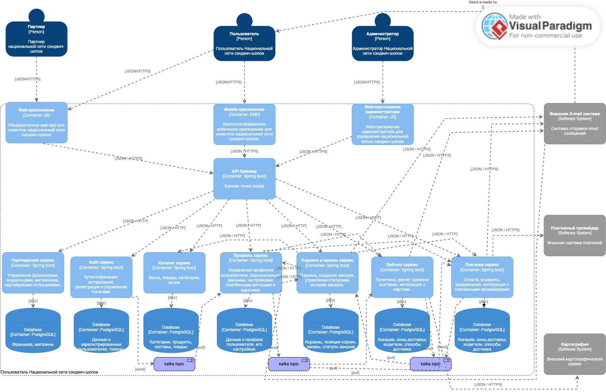

# Национальная сеть сэндвич-шопов

Микросервисы для национальной сети сэндвич-шопов с функцией онлайн-заказов и доставки.

## 🚀 Быстрый доступ

### Пользовательские сценарии
- [Preauthorize](./preauthorize.feature) — стартовая страница
- [Login](./login.feature) — вход в систему
- [Register](./register.feature) — регистрация
- [Menu](./menu.feature) — меню сэндвичей
- [Product Card](./product_card.feature) — карточка товара
- [Cart](./cart.feature) — корзина
- [Order](./order.feature) — оформление заказа
- [Profile](./profile.feature) — профиль пользователя
- [Partner](./partner.feature) — партал франшизы

### Микросервисы
- [Auth Service](#auth-service) — аутентификация, авторизация, регистрация
- [Profile Service](#profile-service) — профиль пользователя, настройки, платёжные методы
- [Catalog Service](#catalog-service) — меню, товары, категории, акции
- [Order Service](#order-service) — корзина, заказы, статусы
- [Delivery Service](#delivery-service) — логистика, расчёт доставки, локации
- [Payment Service](#payment-service) — оплата, возвраты, уведомления
- [Partner Service](#partner-service) — франшизы, магазины, партнёрские отношения

### Документация
- [C4 Model](./C4_model_container.jpg) — диаграмма контейнеров

---

## 📋 Пользовательские сценарии

### 1. Preauthorize (Стартовая страница)

**Файл:** [`preauthorize.feature`](./preauthorize.feature)

| № | Сценарий                                                   |
|---|------------------------------------------------------------|
| 1.1 | Обычный пользователь знакомится с сэндвич-шопами и меню    |
| 1.2 | Потенциальный партнёр узнаёт о возможностях сотрудничества |

---

### 2. Login (Аутентификация)

**Файл:** [`login.feature`](./login.feature)

| № | Сценарий                                               |
|---|--------------------------------------------------------|
| 2.1 | Успешная аутентификация пользователя                   |
| 2.2 | Неверный email при аутентификации                      |
| 2.3 | Неверный пароль при аутентификации                     |
| 2.4 | Предложение зарегистрироваться для нового пользователя |

---

### 3. Register (Регистрация)

**Файл:** [`register.feature`](./register.feature)

| № | Сценарий                                   |
|---|--------------------------------------------|
| 3.1 | Успешная регистрация нового пользователя   |
| 3.2 | Регистрация с уже существующим email       |
| 3.3 | Регистрация с несовпадающими паролями      |
| 3.4 | Регистрация с некорректным email           |
| 3.5 | Регистрация с пустыми обязательными полями |

---

### 4. Menu (Просмотр меню)

**Файл:** [`menu.feature`](./menu.feature)

| № | Сценарий                              |
|---|---------------------------------------|
| 4.1 | Просмотр всех доступных сэндвичей     |
| 4.2 | Фильтрация меню по категориям         |
| 4.3 | Поиск сэндвича по названию            |
| 4.4 | Просмотр ежедневных акций в меню      |
| 4.5 | Просмотр меню с учётом местоположения |
| 4.6 | Сортировка меню по цене               |
| 4.7 | Просмотр популярных сэндвичей         |
| 4.8 | Переход в карточку товара             |

---

### 5. Product Card (Карточка товара)

**Файл:** [`product_card.feature`](./product_card.feature)

| № | Сценарий                              |
|---|---------------------------------------|
| 5.1 | Просмотр основной информации о товаре |
| 5.2 | Просмотр состава и пищевой ценности   |
| 5.3 | Добавление товара в корзину           |
| 5.4 | Просмотр отзывов о товаре             |
| 5.5 | Увеличение изображения товара         |

---

### 6. Cart (Корзина)

**Файл:** [`cart.feature`](./cart.feature)

| № | Сценарий                               |
|---|----------------------------------------|
| 6.1 | Просмотр содержимого корзины           |
| 6.2 | Увеличение количества товара в корзине |
| 6.3 | Уменьшение количества товара в корзине |
| 6.4 | Удаление товара из корзины             |
| 6.5 | Просмотр итоговой суммы заказа         |
| 6.6 | Применение промокода                   |
| 6.7 | Очистка корзины                        |
| 6.8 | Переход к оформлению заказа            |
| 6.9 | Корзина с пустым состоянием            |
| 6.10 | Выбор способа получения заказа         |

---

### 7. Order (Создание заказа)

**Файл:** [`order.feature`](./order.feature)

| № | Сценарий                                                      |
|---|---------------------------------------------------------------|
| 7.1 | Успешное создание заказа с самовывозом                        |
| 7.2 | Успешное создание заказа с доставкой                          |
| 7.3 | Создание заказа с онлайн-оплатой                              |
| 7.4 | Создание заказа с оплатой при получении                       |
| 7.5 | Создание заказа с применением промокода                       |
| 7.6 | Ошибка при создании заказа с невалидным адресом               |
| 7.7 | Отображение статуса заказа на главном экране в фоновом режиме |
| 7.8 | Обновление статуса заказа в реальном времени                  |
| 7.9 | Просмотр истории заказов после создания                       |

---

### 8. Profile (Профиль пользователя)

**Файл:** [`profile.feature`](./profile.feature)

| №    | Сценарий                                                 |
|------|----------------------------------------------------------|
| 8.1  | Просмотр личных данных                                   |
| 8.2  | Редактирование личных данных                             |
| 8.3  | Ошибка при редактировании личных данных                  |
| 8.4  | Просмотр истории заказов                                 |
| 8.5  | Отмена активного заказа                                  |
| 8.6  | Просмотр сохранённых карт                                |
| 8.7  | Добавление новой карты                                   |
| 8.8  | Установка карты по умолчанию                             |
| 8.9  | Удаление сохранённой карты                               |
| 8.10 | Ошибка при добавлении невалидной карты                   |
| 8.11 | Просмотр настроек аккаунта                               |
| 8.12 | Смена языка интерфейса                                   |
| 8.13 | Успешная смена пароля                                    |
| 8.14 | Ошибка при смене пароля с неверным текущим паролем       |
| 8.15 | Ошибка при смене пароля с несовпадающими новыми паролями |
| 8.16 | Удаление аккаунта                                        |
| 8.17 | Отмена удаления аккаунта                                 |

---

### 9. Partner (Парталь франшизы)

**Файл:** [`partner.feature`](./partner.feature)

| №    | Сценарий                             |
|------|--------------------------------------|
| 9.1  | Подача заявки на франшизу            |
| 9.2  | Отслеживание статуса заявки          |
| 9.3  | Заявка одобрена                      |
| 9.4  | Просмотр информации о франшизе       |
| 9.5  | Редактирование информации о франшизе |
| 9.6  | Просмотр списка магазинов            |
| 9.7  | Добавление нового магазина           |
| 9.8  | Редактирование магазина              |
| 9.9  | Закрытие магазина                    |
| 9.10 | Просмотр выручки франшизы            |
| 9.11 | Расчёт роялти                        |
| 9.12 | История выплат                       |
| 9.13 | Ожидание выплаты                     |

---

## ️ C4 Model (диаграмма контейнеров)

Диаграмма контейнеров показывает архитектуру системы на уровне контейнеров (приложений, сервисов, баз данных) и их взаимодействия.

---

## 📐 Описание сервисов

### Auth Service

**Ответственность:** Аутентификация, авторизация, регистрация и управление токенами.

#### API

| метод  | Endpoint                     | Описание          |
|--------|------------------------------|-------------------|
| `POST` | `/api/v1/auth/register`      | регистрация       |
| `POST` | `/api/v1/auth/login`         | вход в систему    |
| `POST` | `/api/v1/auth/logout`        | выход из системы  |
| `POST` | `/api/v1/auth/refresh`       | обновление токена |
| `GET`  | `/api/v1/auth/verify`        | проверка токена   |

#### Публикуемые эвенты

| событие               | описание                              |
|-----------------------|---------------------------------------|
| `user.registered`     | зарегистрирован новый пользователь    |
| `user.login`          | пользователь вошёл в систему          |
| `user.logout`         | пользователь вышел из системы         |

#### Зависимости

| Сервис   | Описание                            |
|----------|-------------------------------------|
| —        | Нет зависимостей от других сервисов |

---

### Profile Service

**Ответственность:** Управление профилем пользователя, персональными данными, настройками, платёжными методами и адресами.

#### API

| метод   | Endpoint                         | Описание                         |
|---------|----------------------------------|----------------------------------|
| `GET`   | `/api/v1/profile`                | получение данных пользователя    |
| `PUT`   | `/api/v1/profile`                | редактирование профиля           |
| `DELETE`| `/api/v1/profile`                | удаление аккаунта (запрос)       |
| `GET`   | `/api/v1/profile/settings`       | получение настроек               |
| `PUT`   | `/api/v1/profile/settings`       | обновление настроек              |
| `GET`   | `/api/v1/profile/cards`          | список сохранённых карт          |
| `POST`  | `/api/v1/profile/cards`          | добавить карту                   |
| `PUT`   | `/api/v1/profile/cards/{id}`     | обновить карту (сделать default) |
| `DELETE`| `/api/v1/profile/cards/{id}`     | удалить карту                    |
| `GET`   | `/api/v1/profile/addresses`      | список адресов доставки          |
| `POST`  | `/api/v1/profile/addresses`      | добавить адрес                   |
| `PUT`   | `/api/v1/profile/addresses/{id}` | редактировать адрес              |
| `DELETE`| `/api/v1/profile/addresses/{id}` | удалить адрес                    |
| `POST`  | `/api/v1/profile/orders`         | история заказов пользователя     |

#### Публикуемые эвенты

| событие              | описание                          |
|----------------------|-----------------------------------|
| `profile.created`    | профиль создан                    |
| `profile.updated`    | профиль обновлён                  |
| `card.added`         | карта добавлена                   |
| `card.removed`       | карта удалена                     |
| `address.added`      | адрес добавлен                    |
| `address.updated`    | адрес обновлён                    |

#### Зависимости

| Сервис | Описание |
|--------|----------|
| Order Service | Получение истории заказов |
| Payment Service | Токенизация карт |
| Delivery Service | Валидация адресов доставки |

---

### Catalog Service

**Ответственность:** Управление меню, товарами, категориями, акциями.

#### API

| метод    | Endpoint                         | Описание                   |
|----------|----------------------------------|----------------------------|
| `GET`    | `/api/v1/menu`                   | получить всё меню          |
| `POST`   | `/api/v1/menu`                   | создать меню               |
| `GET`    | `/api/v1/menu/{id}`              | получить меню              |
| `PUT`    | `/api/v1/menu/{id}`                   | изменить меню              |
| `DELETE` | `/api/v1/menu/{id}`                   | удалить меню               |
| `GET`    | `/api/v1/menu/{id}/item`         | получить позиции в меню    |
| `POST`   | `/api/v1/menu/{id}/item`         | добавить позицию в меню    |
| `GET`    | `/api/v1/menu/{id}/item/{id}`    | получить позицию в меню    |
| `PUT`    | `/api/v1/menu/{id}/item/{id}`    | изменить позицию в меню    |
| `DELETE` | `/api/v1/menu/{id}/item/{id}`    | удалить позицию из меню    |
| `GET`    | `/api/v1/menu/{id}/categories`   | все категории в меню       |
| `GET`    | `/api/v1/menu/{id}/categories/{id}` | получить категорию в меню  |
| `POST`   | `/api/v1/menu/search`            | поиск по названию          |
| `GET`    | `/api/v1/menu/promotions`        | актуальные акции           |
| `GET`    | `/api/v1/menu/popular`           | популярные товары          |
| `GET`    | `/api/v1/menu/location/{id}`     | меню для конкретной локации |

#### Публикуемые эвенты

| событие              | описание                          |
|----------------------|-----------------------------------|
| `product.created`    | новый товар добавлен              |
| `product.updated`    | товар обновлён                    |
| `promotion.started`  | акция началась                     |
| `promotion.ended`    | акция завершилась                 |

#### Зависимости

| Сервис | Описание |
|--------|----------|
| — | Нет зависимостей от других сервисов |

---

### Order Service

**Ответственность:** Корзина, создание заказов, управление статусами, история заказов.

#### API

| метод    | Endpoint                     | Описание                           |
|----------|------------------------------|------------------------------------|
| `GET`    | `/api/v1/cart`               | получить корзину                   |
| `POST`   | `/api/v1/cart/items`         | добавить товар в корзину           |
| `PUT`    | `/api/v1/cart/items/{id}`    | обновить количество                |
| `DELETE` | `/api/v1/cart/items/{id}`    | удалить товар                      |
| `DELETE` | `/api/v1/cart`               | очистить корзину                   |
| `POST`   | `/api/v1/cart/apply-promo`   | применить промокод                 |
| `GET`    | `/api/v1/cart/calculate`     | итоговая сумма                     |
| `POST`   | `/api/v1/orders`             | создать заказ                        |
| `GET`    | `/api/v1/orders`             | история заказов                    |
| `GET`    | `/api/v1/orders/{id}`        | детали заказа                      |
| `GET`    | `/api/v1/orders/{id}/status` | статус заказа                      |
| `POST`   | `/api/v1/orders/{id}/cancel` | отмена заказа                      |
| `POST`   | `/api/v1/orders/{id}/repeat` | повтор заказа                      |

#### Публикуемые эвенты

| событие              | описание                          |
|----------------------|-----------------------------------|
| `cart.updated`       | корзина изменена                  |
| `order.created`      | новый заказ создан                |
| `order.confirmed`    | заказ подтверждён                 |
| `order.cancelled`    | заказ отменён                     |

#### Зависимости

| Сервис | Описание                                  |
|--------|-------------------------------------------|
| Catalog Service | Проверка наличия товара, применение акций |
| Delivery Service | Расчёт времени и стоимости доставки       |
| Profile Service | Получение адреса доставки                 |
| Payment Service | Инициализация платежа                     |

---

### Delivery Service

**Ответственность:** Логистика, расчёт времени доставки, интеграция с картами, локализации.

#### API

| метод   | Endpoint                        | Описание                           |
|---------|---------------------------------|------------------------------------|
| `GET`   | `/api/v1/locations`             | список магазинов                   |
| `GET`   | `/api/v1/locations/{id}`         | детали магазина                    |
| `POST`  | `/api/v1/delivery/calculate`    | расчёт доставки                    |
| `GET`   | `/api/v1/delivery/zones`        | зоны доставки                      |

#### Публикуемые эвенты

| событие              | описание                          |
|----------------------|-----------------------------------|
| `driver.assigned`    | водитель назначен                 |
| `driver.arrived`     | водитель прибыл                   |
| `delivery.completed` | доставка завершена                |

#### Зависимости

| Сервис | Описание                                  |
|--------|-------------------------------------------|
| Partner Service | Информация о магазине                     |
| Catalog Service | Меню для конкретной локации               |
| Google Maps API / Яндекс.Карты | Расчёт маршрутов, пробки (внешний сервис) |

---

### Payment Service

**Ответственность:** Оплата, возвраты, уведомления, отправка по факсу.

#### API

| метод   | Endpoint                        | Описание                           |
|---------|---------------------------------|------------------------------------|
| `POST`  | `/api/v1/payment/initiate`      | инициализация платежа              |
| `POST`  | `/api/v1/payment/confirm`       | подтверждение платежа              |
| `POST`  | `/api/v1/payment/refund`        | возврат средств                    |
| `GET`   | `/api/v1/payment/{id}/status`   | статус платежа                     |

#### Публикуемые эвенты

| событие              | описание                          |
|----------------------|-----------------------------------|
| `payment.initiated`  | платёж начат                      |
| `payment.completed`  | платёж успешен                    |
| `payment.failed`     | платёж не прошёл                  |

#### Зависимости

| Сервис | Описание |
|--------|----------|
| Profile Service | Получение токена карты |
| Stripe / CloudPayments / ЮKassa | Платёжный шлюз (внешний сервис) |

---

### Partner Service

**Ответственность:** Управление франшизами, владельцами, магазинами, партнёрскими отношениями и выплатами.

#### API

| метод   | Endpoint                                                 | Описание                    |
|---------|----------------------------------------------------------|-----------------------------|
| `POST`  | `/api/v1/partners/franchises`                            | подать заявку на франшизу   |
| `GET`   | `/api/v1/partners/franchises`                            | список франшиз пользователя |
| `GET`   | `/api/v1/partners/franchises/{id}`                       | детали франшизы             |
| `PUT`   | `/api/v1/partners/franchises/{id}`                       | редактировать франшизу      |
| `GET`   | `/api/v1/partners/franchises/{id}/locations`             | магазины франшизы           |
| `POST`  | `/api/v1/partners/franchises/{id}/locations`             | добавить магазин            |
| `PUT`   | `/api/v1/partners/franchises/{id}/locations/{id}`        | редактировать магазин       |
| `DELETE`| `/api/v1/partners/franchises/{id}/locations/{id}`        | удалить магазин             |
| `GET`   | `/api/v1/partners/franchises/{id}/locations/{id}/revenue` | выручка магазина            |
| `GET`   | `/api/v1/partners/franchises/{id}/revenue`               | выручка франшизы            |
| `GET`   | `/api/v1/partners/franchises/{id}/royalty`               | расчёт роялти               |
| `GET`   | `/api/v1/partners/payouts`                               | история выплат партнёру     |

#### Публикуемые эвенты

| событие                      | описание                          |
|------------------------------|-----------------------------------|
| `franchise.application_submitted` | заявка на франшизу подана    |
| `franchise.approved`         | франшиза одобрена                 |
| `franchise.location_opened`  | магазин открыт                    |
| `franchise.location_closed`  | магазин закрыт                    |

#### Зависимости

| Сервис | Описание |
|--------|----------|
| Profile Service | Данные владельца, платёжные реквизиты |
| Delivery Service | Информация о магазинах и зонах доставки |
| Payment Service | Приём платежей от франчайзи, выплаты |
| Catalog Service | Единое меню для всех магазинов |
